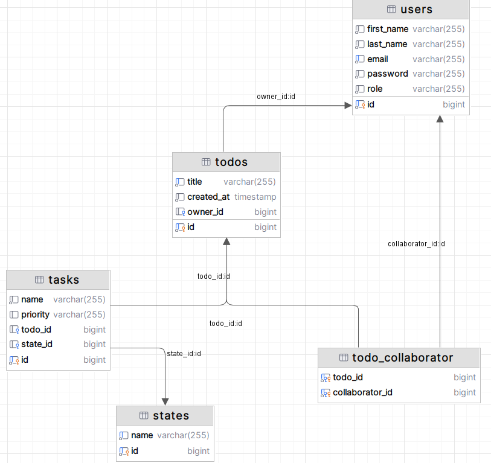

# Hibernate. Part 1
### Create entities that match the given SQL schema:

- **User:** with fields id, firstName, lastName, email, password, and role.
- **ToDo:** with fields id, title, createdAt, and owner_id.
- **Task:** with fields id, name, priority, todo_id, and state_id.
- **State:** with fields id and name.
- **TodoCollaborator:** to store collaboration between todo and users with fields todo_id and collaborator_id.

**Implement Hibernate Validator annotations for all entities:**

- **For User:** 
**firstName and lastName:** cannot be empty. 
**email:** must be a valid email format. 
**password:** must be at least 8 characters long, contain at least one uppercase letter, one lowercase letter, one number, and one special character !@#$%^&*()-_=+[]{}|;:'",.<>?/`~\  
**Valid User:** Anna-Maria Kovalenko-Bynzar with@gcom.com email and qwQW12!@ password 

- **For ToDo:** 
**title:** cannot be empty. 
- **For Task:** 
**name:** must be between 3 and 200 characters. 
- **For State:** 
**name:** must be between 1 and 20 characters, and can only contain Latin letters, numbers, dashes, spaces, and underscores. 
   
Write missing unit tests for all entities, similar to the UserTests class:
